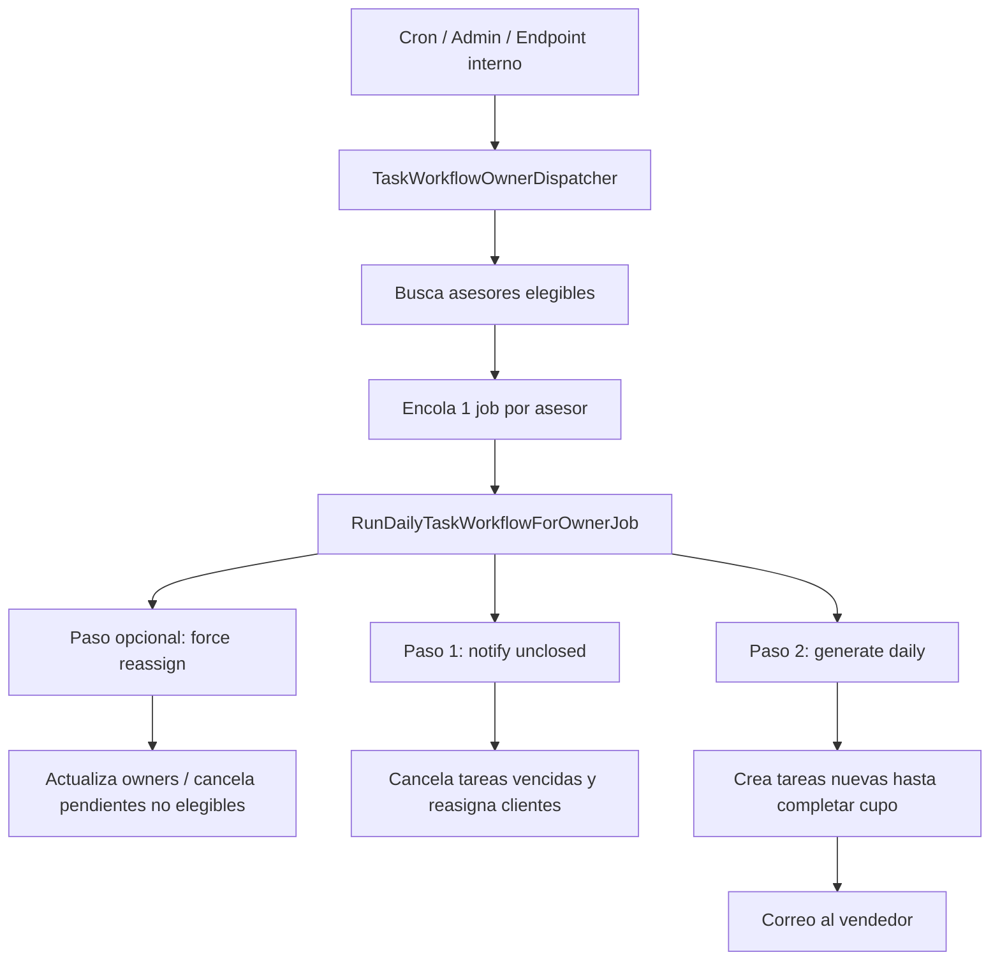

# Informe tecnico: asignacion automatica de tareas

Generado: 2026-06-17

Este informe explica, en lenguaje claro pero tecnico, como la aplicacion decide que tareas se crean, a que vendedor/asesor se asignan, por que algunos dias se generan menos tareas y por que a veces un vendedor no recibe ninguna.

## Resumen ejecutivo

La asignacion de tareas funciona como un flujo diario con cupos.

En palabras simples:

1. El sistema identifica que vendedores pueden recibir tareas.
2. Revisa si hay clientes pendientes en listas habilitadas para el pool de tareas.
3. Limpia o reasigna tareas vencidas.
4. Calcula cuantos espacios libres tiene cada vendedor ese dia.
5. Busca contactos validos, evita repetirlos y confirma su owner en HubSpot.
6. Crea tareas pendientes para completar el cupo disponible.
7. Notifica por correo al vendedor cuando se le asignan tareas nuevas.

La parte importante: el sistema no reparte tareas "porque si". Tiene filtros fuertes para no duplicar contactos, no insistir con clientes ya gestionados, respetar cupos, respetar HubSpot y evitar mover varias veces al mismo contacto en el mismo dia.

## Conceptos clave

| Concepto | Que significa en la app |
|---|---|
| Vendedor / asesor | Usuario interno que recibe tareas comerciales. Tecnicamente es un `users.id` vinculado a un HubSpot Owner activo. |
| Contacto / cliente | Tambien es un registro de `users`, pero usado como `contact_id` en la tarea. |
| Tarea | Registro en `tasks` asignado a un vendedor (`user_id`) para gestionar un contacto (`contact_id`). |
| Pool de tareas | Conjunto de contactos que estan en listas (`lists`) habilitadas con `include_in_task_pool = true` y aun no estan marcados como contactados. |
| Cupo diario | Cantidad maxima de tareas que el vendedor debe tener para una fecha. Por defecto es `--per=10`, pero puede personalizarse con `users.task_assignment_daily_limit`. |
| Owner de HubSpot | Propietario comercial del contacto en HubSpot. La app intenta respetarlo para que no se asignen tareas a un vendedor equivocado. |
| Cola / job | Trabajo en segundo plano. El workflow puede encolar un job por vendedor y luego `/cron/tasks/work` procesa uno por llamada. |

## Mapa general del flujo



## Archivos principales

| Archivo | Responsabilidad |
|---|---|
| `app/Console/Kernel.php` | Programa el workflow automatico en dias de semana. |
| `app/Services/TaskWorkflowOwnerDispatcher.php` | Encuentra asesores elegibles y encola un job por cada uno. |
| `app/Jobs/RunDailyTaskWorkflowForOwnerJob.php` | Ejecuta el flujo para un asesor concreto. |
| `app/Console/Commands/RunDailyTaskWorkflow.php` | Orquesta reasignacion forzada, revision de vencidas y generacion diaria. |
| `app/Console/Commands/GenerateDailyTasks.php` | Crea tareas diarias respetando cupos y filtros. |
| `app/Console/Commands/NotifyUnclosedTasks.php` | Cancela tareas vencidas y reasigna el cliente. |
| `app/Http/Controllers/TaskController.php` | Guarda el resultado de una tarea cuando el vendedor la trabaja. |
| `app/Models/Task.php` | Define estados, relaciones y helpers de tareas. |
| `app/Http/Controllers/HubspotOwnerController.php` | Permite activar/excluir vendedores y fijar limites diarios. |
| `app/Http/Controllers/ListController.php` | Permite configurar si una lista entra al pool y si bloquea reasignacion en HubSpot. |

## Paso 0: como se dispara el workflow

Hay varias formas de iniciar el proceso.

### Programado por Laravel

En `app/Console/Kernel.php` el flujo esta programado en dias de semana a las 6:00:

```php
$schedule->command('tasks:daily-workflow --force-reassign')
         ->weekdays()
         ->at('6:00')
         ->withoutOverlapping()
         ->appendOutputTo(storage_path('logs/tasks-daily-workflow.log'));
```

Esto ejecuta el comando principal `tasks:daily-workflow --force-reassign`.

### Desde el panel admin

En `AdminTaskController` hay dos acciones:

```php
app(TaskWorkflowOwnerDispatcher::class)->dispatch([
    '--date' => $date,
    '--skip-notify' => true,
    '--skip-force' => true,
], auth()->id());
```

Y para el workflow forzado:

```php
$options = [
    '--force-reassign' => true,
    '--per' => (int) ($data['per'] ?? 10),
    '--force-limit' => (int) ($data['force_limit'] ?? 200),
];
```

### Desde endpoint interno

`InternalTaskWorkflowController` acepta un token y encola el workflow:

```php
$options = [
    '--force-reassign' => $request->boolean('force_reassign', true),
    '--force-limit' => max(1, (int) $request->query('force_limit', 200)),
    '--per' => max(1, (int) $request->query('per', 10)),
];
```

### Procesamiento de la cola

El endpoint `/cron/tasks/work` ejecuta la cola `tasks`, pero con limite de 1 job por llamada:

```php
Artisan::call('queue:work', [
    'connection' => 'database',
    '--queue' => self::QUEUE,
    '--stop-when-empty' => true,
    '--tries' => 1,
    '--timeout' => $timeout,
    '--max-jobs' => $jobs,
]);
```

Esto importa porque si se encolan 8 vendedores, hacen falta 8 llamadas a `/cron/tasks/work` para procesarlos todos.

Referencia tecnica externa: colas de Laravel, `queue:work`: https://laravel.com/docs/11.x/queues

## Paso 1: seleccionar vendedores elegibles

El sistema no toma todos los usuarios. Solo toma vendedores que cumplan estas condiciones:

1. Tienen un HubSpot Owner vinculado.
2. Ese owner esta activo.
3. El owner no esta vacio.
4. El usuario no esta excluido de asignaciones automaticas.
5. Su limite diario es `NULL` o mayor a cero.

Extracto de `TaskWorkflowOwnerDispatcher`:

```php
return User::query()
    ->join('hubspot_owner_user as hou', 'hou.user_id', '=', 'users.id')
    ->join('hubspot_owners as ho', 'ho.id', '=', 'hou.hubspot_owner_id')
    ->where('ho.active', true)
    ->whereNotNull('hou.hubspot_owner_id')
    ->whereRaw("TRIM(hou.hubspot_owner_id) <> ''")
    ->where('users.exclude_from_task_assignment', false)
    ->where(function ($query) {
        $query->whereNull('users.task_assignment_daily_limit')
            ->orWhere('users.task_assignment_daily_limit', '>', 0);
    })
    ->orderBy('users.name');
```

Traduccion humana: si el vendedor no tiene owner activo de HubSpot, esta excluido, o tiene limite diario `0`, no entra al reparto automatico.

## Paso 2: encolar un job por vendedor

El dispatcher reparte el trabajo en jobs separados:

```php
RunDailyTaskWorkflowForOwnerJob::dispatch(
    (int) $advisor->id,
    trim(($advisor->name ?? "Usuario {$advisor->id}") . ' <' . ($advisor->email ?? 'sin correo') . '>'),
    $ownerOptions,
    $adminUserId,
    $index === 0
)
    ->onConnection('database')
    ->onQueue(self::QUEUE);
```

Cada job queda limitado a un asesor con `--advisor-id`. Esto evita que un solo proceso largo intente hacer todo de una vez y permite procesar por partes.

Detalle importante: el primer job ejecuta limpieza de listas (`$index === 0`). Los siguientes jobs generan para su asesor sin repetir esa limpieza global.

## Paso 3: reasignacion forzada previa

Si se ejecuta con `--force-reassign`, el sistema revisa contactos que necesitan ser movidos antes de generar tareas nuevas.

El comando busca cinco tipos de candidatos:

| Motivo tecnico | Significado |
|---|---|
| `tarea cancelada` | El contacto tenia una tarea cancelada y puede volver al flujo. |
| `tarea completada no efectiva` | Se intento contactar, pero no hubo resultado efectivo. |
| `en lista sin tareas` | El contacto esta en una lista activa pero no tiene tareas. |
| `owner no elegible para tareas` | El contacto pertenece a alguien que no puede recibir tareas automaticas. |
| `tarea pendiente en usuario no elegible` | La tarea pendiente esta en un usuario que ya no deberia recibir tareas. |

Extracto:

```php
$canceled = User::query()
    ->selectRaw("'tarea cancelada' as force_reason");

$ineffective = User::query()
    ->selectRaw("'tarea completada no efectiva' as force_reason");

$withoutTasks = User::query()
    ->selectRaw("'en lista sin tareas' as force_reason");

$withoutEligibleOwner = User::query()
    ->selectRaw("'owner no elegible para tareas' as force_reason");

$openTasksFromIneligible = User::query()
    ->selectRaw("'tarea pendiente en usuario no elegible' as force_reason");
```

Si el job esta limitado a un asesor, primero revisa cuantos cupos le quedan:

```php
$assignedTodayCount = Task::query()
    ->where('user_id', $advisor->id)
    ->whereDate('due_date', $taskDate)
    ->where('status', '!=', Task::STATUS_CANCELED)
    ->count();

return max(0, $advisorBase - $assignedTodayCount);
```

Traduccion humana: aunque existan contactos para reasignar, si el vendedor ya lleno su cupo del dia, no se le meten mas.

## Paso 4: revisar tareas vencidas

`tasks:notify-unclosed` busca tareas pendientes que vencieron hace al menos 1 dia:

```php
private const TASK_RESPONSE_DAYS = 1;

$limitDate = $date->copy()
    ->subDays(self::TASK_RESPONSE_DAYS)
    ->endOfDay();
```

Luego filtra tareas:

```php
Task::query()
    ->where('status', Task::STATUS_PENDING)
    ->notAssignedToSystems()
    ->whereNotNull('due_date')
    ->whereDate('due_date', '<=', $limitDate->toDateString())
    ->whereNotNull('contact_id');
```

Cuando encuentra una tarea vencida:

1. La cancela.
2. Reasigna el cliente a otro asesor usando round robin.
3. Actualiza `owner_id` en la app.
4. Intenta actualizar `hubspot_owner_id` en HubSpot.
5. Notifica a los administradores.

Si la lista del contacto tiene `disable_hubspot_reassignment = true`, no mueve HubSpot. En ese caso crea una tarea de reintento para el mismo vendedor:

```php
if ($skipHubspotReassignment) {
    $hubspotSkippedByList++;
    $retryTask = $this->createRetryTask($task, $date);
    continue;
}
```

Esto explica un caso comun: puede haber tareas nuevas, pero no necesariamente por reasignacion completa; algunas son reintentos locales porque la lista bloquea cambios en HubSpot.

## Paso 5: construir el pool de contactos disponibles

La generacion diaria toma contactos desde `list_user` y `lists`.

Filtro base:

```php
$contacts = DB::table('list_user as lu')
    ->join('users as u', 'u.id', '=', 'lu.user_id')
    ->join('lists as l', 'l.id', '=', 'lu.list_id')
    ->where('lu.contacted', 0)
    ->where('l.include_in_task_pool', true)
    ->get();
```

Traduccion humana:

1. El contacto debe estar en una lista.
2. En esa lista todavia no debe estar marcado como contactado.
3. La lista debe estar habilitada para generar tareas.

Si una lista no tiene `include_in_task_pool = true`, sus contactos no entran al reparto automatico.

## Paso 6: sacar contactos que no deben volver a asignarse

Antes de crear tareas, el sistema excluye contactos que ya dieron una senal clara.

Por ejemplo, contactos con tareas completadas efectivas, respuesta del cliente, estado comercial, motivo de desinteres o interes negativo:

```php
$nonReassignableContacts = Task::query()
    ->where(function ($q) {
        $q->whereIn('status', ['desinteres', 'no_interest', 'not_interested'])
            ->orWhere(function ($completed) {
                $completed->where('status', Task::STATUS_COMPLETED)
                    ->where(function ($effective) {
                        $effective->where('call_effective', 1)
                            ->orWhere('customer_responded', 1)
                            ->orWhereNotNull('sale_status')
                            ->orWhereNotNull('reason_no_interest')
                            ->orWhere('interest_level', 0);
                    });
            });
    });
```

Ademas excluye contactos con tareas abiertas:

```php
$inProgressContacts = Task::query()
    ->where('status', Task::STATUS_IN_PROGRESS);

$pendingContacts = Task::query()
    ->where('status', Task::STATUS_PENDING)
    ->notAssignedToSystems();
```

Traduccion humana: si el contacto ya esta en gestion, o ya se gestiono con resultado claro, el sistema no crea otra tarea para molestarlo ni duplica trabajo.

## Paso 7: calcular el cupo disponible del vendedor

Cada vendedor tiene un cupo base. Si no tiene limite personalizado, usa `--per`, normalmente 10. Si tiene limite, usa ese.

```php
$dailyLimit = $advisor->task_assignment_daily_limit;
$advisorBase = is_null($dailyLimit)
    ? $base
    : max(0, (int) $dailyLimit);
```

Luego cuenta cuantas tareas ya tiene para esa fecha:

```php
$assignedTodayCount = Task::query()
    ->where('user_id', $advisor->id)
    ->whereDate('due_date', $date)
    ->where('status', '!=', Task::STATUS_CANCELED)
    ->count();

$toCreate = max(0, $advisorBase - $assignedTodayCount);
```

Traduccion humana: el sistema no crea "10 nuevas" necesariamente. Crea las que falten para llegar a 10.

Ejemplo:

| Cupo | Ya tiene hoy | Se crean |
|---:|---:|---:|
| 10 | 0 | 10 |
| 10 | 4 | 6 |
| 10 | 10 | 0 |
| 5 | 2 | 3 |
| 0 | 0 | 0 |

Por eso un dia puede parecer que "salieron pocas tareas": quizas varios vendedores ya tenian tareas del dia por seguimientos, tareas manuales o reintentos.

## Paso 8: evitar duplicados y saturacion del contacto

El sistema aplica filtros por contacto:

```php
return in_array($contactId, $assignedContactIdsThisRun, true)
    || in_array($contactId, $alreadyTaskedToday, true)
    || in_array($contactId, $recentlyTasked, true)
    || in_array($contactId, $pendingContacts, true)
    || in_array($contactId, $inProgressContacts, true)
    || $this->wasReassignedTodayToDifferentAdvisor($contact, $advisor, $reassignmentDate)
    || in_array($contactId, $nonReassignableContacts, true);
```

Esto evita:

1. Asignar dos veces el mismo contacto en la misma corrida.
2. Asignar un contacto que ya tiene tarea hoy.
3. Repetir al mismo asesor un contacto gestionado en los ultimos 7 dias.
4. Crear una tarea si ya hay una pendiente o en curso.
5. Mover un contacto varias veces el mismo dia.
6. Reabrir contactos ya efectivos o desinteresados.

## Paso 9: confirmar owner de HubSpot

Antes de crear la tarea, la app consulta/valida el owner real de HubSpot.

Si HubSpot dice que el contacto pertenece a otro asesor interno, el sistema lo omite para este vendedor:

```php
if ((int) $hubspotAdvisor->id !== (int) $advisor->id) {
    User::whereKey((int) $contact->contact_id)
        ->update($this->ownerSyncAttributes((int) $hubspotAdvisor->id, (string) $hubspotOwnerId));

    $this->line("   - Omitido: HubSpot dice que contact_id={$contact->contact_id} pertenece a {$hubspotAdvisor->name}, no a {$advisor->name}.");
    return false;
}
```

Si el contacto no tiene owner en HubSpot y la lista permite reasignar, intenta asignarlo antes de crear la tarea:

```php
$hubspot->updateContact($hsContactId, [
    'hubspot_owner_id' => (string) $advisor->hs_owner_id,
]);
```

Traduccion humana: la app intenta que la tarea y HubSpot cuenten la misma historia.

## Paso 10: crear la tarea

Cuando el contacto pasa todos los filtros, se crea una tarea pendiente:

```php
$task = Task::create([
    'user_id'            => $advisor->id,
    'contact_id'         => $contact->contact_id,
    'title'              => "Comunicarse con el cliente {$contact->contact_name} [Lista: {$contact->list_name}]",
    'description'        => $this->taskDescriptionForGeneratedContact($contact, $ownerChanged, $previousOwner, $skipHubspotByList),
    'due_date'           => $date->toDateString(),
    'status'             => Task::STATUS_PENDING,
    'created_by_user_id' => null,
]);
```

Campos importantes:

| Campo | Uso |
|---|---|
| `user_id` | Vendedor que debe gestionar. |
| `contact_id` | Cliente/contacto a llamar o escribir. |
| `due_date` | Fecha para la que cuenta el cupo. |
| `status` | Nace como `pending`. |
| `description` | Guarda lista origen y notas de reasignacion. |

## Paso 11: correo de tareas asignadas

Al final de cada vendedor, si se crearon tareas y no es `dry-run`, se envia correo:

```php
if ($sendEmails && ! empty($createdTaskIds)) {
    $this->sendAssignedTasksEmail($advisor, $createdTaskIds, $date);
}
```

Si no llega correo, no siempre significa que no haya tareas. Puede significar:

1. No se crearon tareas nuevas.
2. El vendedor no tiene email.
3. Fallo el envio de correo.
4. Se ejecuto con `--no-email` o `--dry-run`.

## Que pasa cuando el vendedor trabaja la tarea

Cuando el vendedor registra resultado, `TaskController` guarda informacion comercial:

```php
$task->contact_methods = $methods;
$task->customer_responded = $customerResponded;
$task->call_effective = $customerResponded;
$task->follow_up_date = $followUpDate;
$task->status = $waitingForResponse
    ? Task::STATUS_IN_PROGRESS
    : Task::STATUS_COMPLETED;
```

Si el cliente no respondio, la tarea queda `in_progress` y se programa para manana:

```php
if ($waitingForResponse && ! $followUpDate) {
    $followUpDate = today()->addDay()->toDateString();
}
```

Si hay seguimiento futuro, se crea una nueva tarea:

```php
Task::create([
    'user_id'     => $original->user_id,
    'contact_id'  => $original->contact_id,
    'title'       => "Seguimiento: {$name}",
    'description' => "Seguimiento generado desde tarea #{$original->id}",
    'due_date'    => $followDate->toDateString(),
    'status'      => 'pending',
]);
```

Cuando el contacto fue gestionado de forma efectiva, `MarkContactedService` lo marca como contactado en sus listas:

```php
$lista->users()->updateExistingPivot($contact->id, [
    'contacted'    => true,
    'contacted_at' => $now,
    'contact_note' => $note,
]);
```

Eso lo saca del pool futuro.

## Por que un dia hay menos tareas que otro

Las causas mas probables son:

### 1. El cupo ya estaba ocupado

El sistema no crea el cupo completo cada dia; solo rellena lo que falta. Si un vendedor ya tiene tareas con `due_date` de hoy, el sistema crea menos.

Ejemplo: cupo 10, ya tiene 7 tareas hoy, se crean 3.

### 2. Hay muchos contactos ya pendientes o en curso

Contactos con tareas `pending` o `in_progress` no se duplican.

### 3. Los contactos disponibles ya fueron gestionados

Si una tarea fue completada con respuesta, venta, interes negativo, motivo de desinteres o llamada efectiva, el contacto sale del ciclo normal.

### 4. Las listas no estan habilitadas para el pool

Solo entran contactos de listas con:

```php
l.include_in_task_pool = true
```

Si una lista se desactiva del pool, sus contactos dejan de generar tareas.

### 5. Los contactos ya estan marcados como contactados

Solo entran filas de `list_user` con:

```php
lu.contacted = 0
```

Cuando un contacto se marca como contactado, queda fuera.

### 6. El filtro semanal bloquea repeticion

Para el mismo asesor, el sistema evita repetir contactos que ya tuvieron tarea en los ultimos 7 dias.

### 7. HubSpot no coincide con el vendedor

Si HubSpot dice que un contacto pertenece a otro owner, la tarea no se crea para el vendedor actual.

### 8. No se pudieron sincronizar datos con HubSpot

Si no se puede resolver o actualizar el contacto en HubSpot, algunos contactos se omiten para no crear una asignacion incoherente.

### 9. Es fin de semana

El scheduler automatico usa:

```php
->weekdays()
```

Por defecto no corre sabado ni domingo desde el `Kernel`.

### 10. La cola no se proceso completa

El sistema encola un job por vendedor, pero `/cron/tasks/work` procesa solo 1 job por llamada. Si no se llama suficientes veces, algunos vendedores quedan pendientes para procesarse despues.

## Por que un vendedor no recibe tareas

Checklist rapido:

| Causa | Como se ve |
|---|---|
| No tiene HubSpot Owner vinculado | No aparece en los asesores elegibles. |
| El HubSpot Owner esta inactivo | `ho.active` no es `true`. |
| Esta excluido de asignaciones automaticas | `users.exclude_from_task_assignment = true`. |
| Tiene limite diario en cero | `users.task_assignment_daily_limit = 0`. |
| Ya lleno su cupo | `assignedTodayCount >= advisorBase`. |
| No hay contactos disponibles para el | El pool queda vacio luego de filtros. |
| HubSpot dice que los contactos son de otro owner | Se omiten por mismatch de owner. |
| Sus contactos estan pending/in_progress | No se duplican. |
| Sus listas no entran al pool | `include_in_task_pool = false`. |
| Los contactos ya estan contactados | `list_user.contacted = 1`. |
| La cola no proceso su job | El job sigue en `jobs` hasta que `/cron/tasks/work` lo ejecute. |
| Se ejecuto en `dry-run` | Simula, pero no escribe. |

## Round robin: como se elige el siguiente asesor

Cuando hay que mover un contacto a otro asesor, se usa round robin por `users.id`.

Extracto:

```php
$lastAdvisorId = (int) Setting::get('tasks.reassignment_round_robin_last_user_id', 0);
$nextAdvisor = $advisors->firstWhere('id', '>', $lastAdvisorId) ?? $advisors->first();

Setting::set('tasks.reassignment_round_robin_last_user_id', (string) $nextAdvisor->id);
```

Traduccion humana: recuerda quien recibio la ultima reasignacion y busca el siguiente. Cuando llega al final, vuelve al primero.

## Controles de administracion

### Excluir o limitar vendedores

`HubspotOwnerController` permite guardar:

```php
'exclude_from_task_assignment' => ['sometimes', 'required', 'boolean'],
'task_assignment_daily_limit' => ['sometimes', 'nullable', 'integer', 'min:0', 'max:100'],
```

Esto alimenta directamente los filtros de elegibilidad.

### Configurar listas

`ListController` guarda:

```php
$data['include_in_task_pool'] = $request->boolean('include_in_task_pool');
$data['disable_hubspot_reassignment'] = $request->boolean('disable_hubspot_reassignment');
```

`include_in_task_pool` decide si la lista participa en generacion de tareas.

`disable_hubspot_reassignment` permite que haya tareas/reintentos locales sin cambiar el owner en HubSpot.

## Consultas utiles de diagnostico

Estas consultas sirven para entender un dia con pocas tareas.

### Tareas por vendedor y fecha

```sql
SELECT user_id, status, COUNT(*) AS total
FROM tasks
WHERE DATE(due_date) = '2026-06-17'
GROUP BY user_id, status
ORDER BY user_id, status;
```

### Vendedores excluidos o con limite cero

```sql
SELECT id, name, email, exclude_from_task_assignment, task_assignment_daily_limit
FROM users
WHERE exclude_from_task_assignment = 1
   OR task_assignment_daily_limit = 0
ORDER BY name;
```

### Contactos disponibles en listas del pool

```sql
SELECT l.id AS list_id, l.name, COUNT(*) AS contactos_disponibles
FROM list_user lu
JOIN lists l ON l.id = lu.list_id
WHERE lu.contacted = 0
  AND l.include_in_task_pool = 1
GROUP BY l.id, l.name
ORDER BY contactos_disponibles DESC;
```

### Jobs pendientes de la cola de tareas

```sql
SELECT queue, COUNT(*) AS pendientes
FROM jobs
GROUP BY queue;
```

### Tareas abiertas que bloquean nuevos contactos

```sql
SELECT contact_id, COUNT(*) AS abiertas
FROM tasks
WHERE status IN ('pending', 'in_progress')
GROUP BY contact_id
HAVING abiertas > 0
ORDER BY abiertas DESC;
```

## Lectura final para negocio

El sistema favorece control sobre volumen.

Eso significa que es normal ver diferencias entre dias:

1. Un dia con mucho contacto fresco en listas habilitadas puede generar muchas tareas.
2. Un dia con muchos seguimientos ya programados puede generar pocas nuevas.
3. Un dia con pocos contactos validos, muchos pending/in_progress o muchos contactos ya gestionados puede generar casi nada.
4. Un vendedor sin owner activo, excluido, con limite cero o con cupo lleno no recibira tareas nuevas.
5. Si la cola no se procesa completa, algunos vendedores pueden no ver tareas hasta que su job corra.

En resumen: las tareas se asignan por elegibilidad del vendedor, disponibilidad real del contacto, cupo diario, historial reciente y coherencia con HubSpot. Cuando cualquiera de esas piezas falla o ya esta cubierta, el sistema prefiere no crear una tarea antes que duplicar trabajo o mover un cliente incorrectamente.
